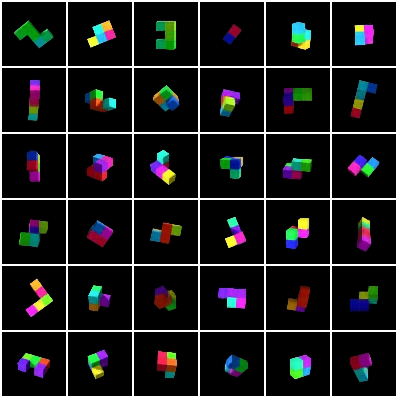

# gqn-pytorch
Implementation of [GQN](http://science.sciencemag.org/content/360/6394/1204.full?ijkey=kGcNflzOLiIKQ&keytype=ref&siteid=sci) in PyTorch.

I'd like to encourage you to also check out these two implementations that I used extensively for inspiration, troubleshooting, etc.:

https://github.com/iShohei220/torch-gqn  
https://github.com/wohlert/generative-query-network-pytorch

They're probably more accessible than this implementation, because I tried to make mine very flexible.  
That being said, what I found a little bit annoying with the others was the need to convert the data first, so I uploaded them in numpy format for your convenience, to be found [here](https://console.cloud.google.com/storage/browser/gqn-datasets), so you should have this one up and running faster than the others ;) So far I only uploaded the Shepard-Metzler-5 set, but more will follow.

No readme is complete without at least one nice picture, so here are some example predictions from the prior (bottom) along with the groundtruth (top) after training for 1 million batches (the model could see all other viewpoints for the prediction).

### Prerequisites

I've only tried this with Python 3, but feel free to give it a go with version 2 and report any errors (or that it's working fine), it shouldn't take much to get it to work. Also, Windows is probably not working, not least because the batchgenerators I'm using don't support it. All dependencies are listed in requirements.txt, at the moment there are only two, [batchgenerators](https://github.com/MIC-DKFZ/batchgenerators) and [trixi](https://github.com/MIC-DKFZ/trixi), everything else you need will be installed with them. This GQN implementation will also become an official trixi example very soon :)

### Running

1. Download the data from [here](https://console.cloud.google.com/storage/browser/gqn-datasets). By default the loader will assume that the data folder is on the same level as this repository. You can also set the data location from the CLI.

2. Install dependencies (if you work with virtualenv or conda, it's probably good practice to set up a new environment first).

        pip install -r requirements.txt

2. If you want live monitoring using Visdom, start the server

        python -m visdom.server -port 8080

   trixi uses port 8080 by default instead of 8097.

3. Run the experiment with

        python run.py OUTPUT_FOLDER [-v]

   where -v indicates you want to use a VisdomLogger. If you look into run.py, you will find a rather large default Config. Everything in this Config will be exposed to the command line automatically, as is described in the [trixi docs](https://trixi.readthedocs.io/en/latest/_api/trixi.util.html#module-trixi.util.config). For example, if you don't want to hardcode the location of the data, you can just use the data_dir attribute via `--data_dir SOME_OTHER_LOCATION`. So far there is only one mod SHAREDCORES, i.e. modification to the default Config, but in principle mods are designed to be combined, e.g. `-m MOD1 MOD2`. You can of course resume experiments and do everything else that trixi offers.

### Speed, Stability and Performance

I'm using PyTorch 1.0.0 with CUDA 10.0.130 and CuDNN 7.4.1, and sometimes I get a CUDNN_STATUS_INTERNAL_ERROR in the backward pass. I'm not entirely sure what the reason for this is, other people have had similar errors in different contexts and with different PyTorch versions. If you encounter this problem, set `cudnn_benchmark = False` in run.py. Unfortunately that makes the whole thing quite a bit slower, ~1.1s/~1.5s per batch with and without shared cores versus ~0.6s/~0.8s when cudnn_benchmark is on.

I can fit batches of size 36 on my TitanXp with 12GB memory. I'm not sure that's how it's supposed to be, because in the paper the authors state that they're working with batch size 36 on 4 K80 GPUs. Not sure whether that's 24GB K80s or 12GB like the Google Colab ones. My best guess is that it's the latter and they just had a full batch on each at a time. Running the experiment for 1 million batches (paper used twice as many) took me 22 days.

### TBD

To be honest I don't see myself investing loads of time into this project, so feel free work on it yourself, pull requests are more than welcome :) A few things that are missing.

* Multi-GPU support
* A test function (as opposed to training and validation)
* Actual tests (as in unittests)
* More datasets
